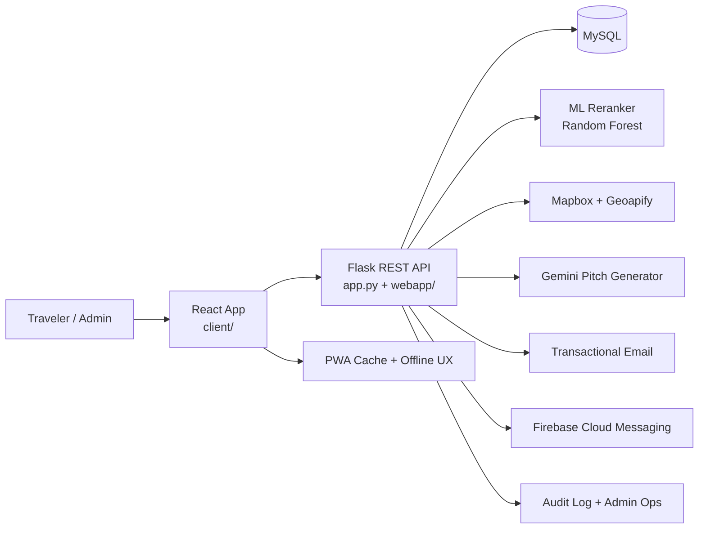
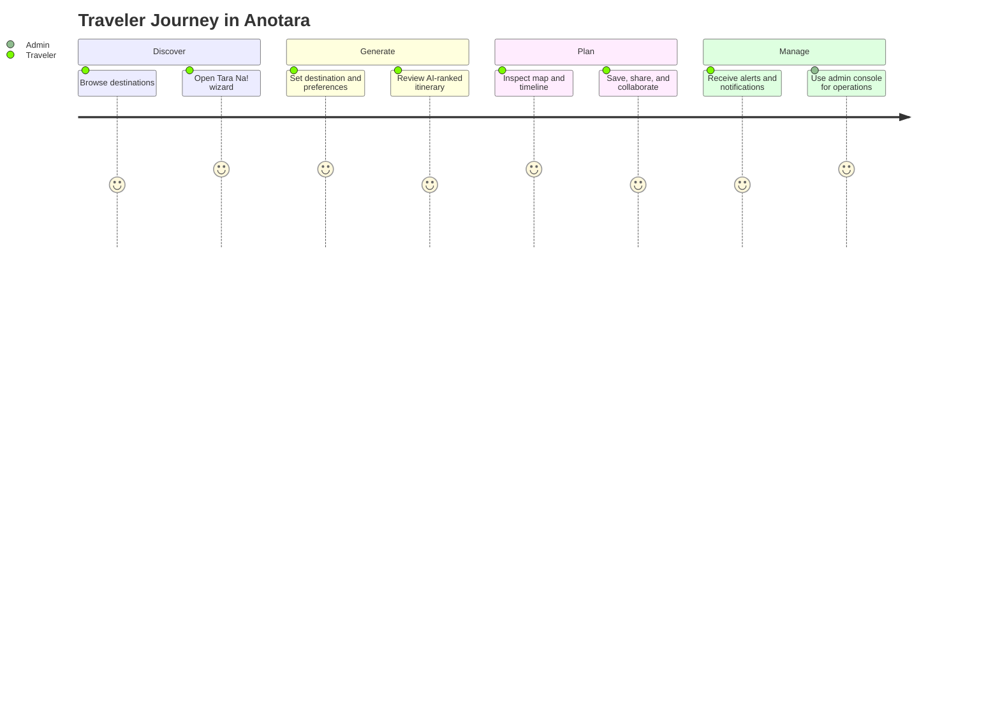

# Anotara Travel Planner

<p align="center">
  
  
  
  
</p>

<p align="center">
  A production-minded, AI-assisted travel planning platform for the Philippines with itinerary generation, map-based trip planning, collaboration, notifications, and an enterprise operations console.
</p>

<p align="center">
  <a href="#visual-overview">Visual Overview</a> •
  <a href="#feature-highlights">Feature Highlights</a> •
  <a href="#quick-start">Quick Start</a> •
  <a href="#environment-variables">Environment Variables</a> •
  <a href="#project-structure">Project Structure</a>
</p>

---

## What is Anotara?

Anotara is a full-stack travel intelligence system that turns a destination, budget, travel length, vibe, and companion profile into a practical itinerary. It combines a React frontend, a Flask API, MySQL persistence, external mapping and place services, machine-learning ranking, transactional email, Firebase push notifications, and a route-driven admin console.

It is built to feel like a premium product, not just a CRUD app: the user experience is mobile-first and PWA-friendly, while the backend includes authenticated sessions, role-based access control, audit logging, backup/restore tooling, and operational visibility for support and admin teams.

## Visual Overview





## Feature Highlights

| Area | What it delivers |
| --- | --- |
| Planning | A multi-step trip wizard that captures destination, duration, budget, companions, pacing, transport, vibes, and constraints. |
| Intelligence | ML-based ranking, route-aware stop ordering, explainable recommendations, and a Gemini-powered itinerary pitch. |
| Trust | JWT sessions, refresh-cookie renewal, OTP/TOTP flows, rate limiting, RBAC, sanitized text handling, and audit trails. |
| Collaboration | Friends, trip invites, voting rooms, shared itinerary presence, and memory notes for trip items. |
| Operations | Admin dashboard, email ops, push monitoring, weather safety, analytics, backups, and ML retraining. |
| Experience | Mobile-first design, PWA offline support, map sync, notification center, and polished loading/empty states. |

## Why This Repository Stands Out

- It is not just a travel planner; it is a trip decision system with recommendation, logistics, collaboration, and operations in one product.
- The active frontend is route-driven and visually polished, with a premium mobile-first experience built for real users.
- The backend is designed like an internal platform: security controls, operational visibility, backups, and admin workflows are first-class.
- The system is built to scale across product, support, and data workflows without turning the codebase into a single oversized screen.

## Feature Highlights In Detail

### Traveler Experience

- Personalized itinerary generation based on destination, travel length, interests, budget, companions, and vibe.
- Route-aware stop selection that keeps the day practical instead of simply listing nearby places.
- Interactive itinerary workspace with a map, timeline, weather-aware alternatives, swap actions, and printable output.
- Saved trips vault with lifecycle states for drafts, upcoming, active, and past trips.
- Discovery experiences that help users go from browsing to planning in a few taps.

### Security and Access Control

- Email OTP registration and login for standard users.
- Google Authenticator TOTP for admin and super-admin access.
- Password reset links with time limits and replay protection.
- Live database-backed role checks for protected routes.
- Rate limiting on auth flows and cleanup of private client-side session state.

### Communications and Notifications

- Transactional email for account events, invitations, reminders, and security messages.
- Firebase Cloud Messaging for device push notifications.
- Notification center for in-app visibility of user-facing events.
- Weather alerts and fallback delivery for critical itinerary changes.

### Admin and Operations

- Route-driven operations console with overview, operations, intelligence, governance, and infrastructure sections.
- User management, content moderation, analytics, audit logs, email queue visibility, weather monitoring, and backup/restore.
- ML retraining tools for refreshing recommendation quality.
- Structured privileged-action logging for accountability.

## Tech Stack

| Layer | Tools |
| --- | --- |
| Frontend | React 19, Vite, React Router, Framer Motion, Mapbox GL, PWA support |
| Backend | Flask, Flask-JWT-Extended, Flask-Bcrypt, Flask-Limiter, Flask-CORS |
| Data | MySQL, CSV/Parquet dataset support, local ML artifacts |
| Intelligence | scikit-learn, Gemini pitch generation, Geoapify, Mapbox |
| Messaging | SMTP providers, SendGrid/Mailgun support, Firebase Cloud Messaging |
| Ops | Admin routes, audit logs, backups, weather monitor, email queue, CLI commands |

## Quick Start

### Prerequisites

- Python 3.11 or newer
- Node.js 18 or newer
- MySQL 8+
- A configured `.env` file for the backend
- Optional but recommended: Firebase, Mapbox, Geoapify, and Gemini API credentials

### 1) Clone the repository

```bash
git clone <your-repo-url>
cd Anotara-app
```

### 2) Set up the backend

```bash
python -m venv .venv
.venv\Scripts\Activate.ps1
pip install -r requirements.txt
```

Create a root-level `.env` file with your database credentials and integrations. See the environment section below for the full list.

Run the backend with:

```bash
flask --app app run --debug
```

### 3) Set up the frontend

```bash
cd client
npm install
npm run dev
```

The Vite app runs separately from Flask and expects the backend to allow requests from the frontend origin.

### 4) Seed the local admin account

If you need a local super-admin for development:

```bash
set ANOTARA_ADMIN_PASSWORD=your-strong-password
python seed_admin_user.py
```

## Environment Variables

### Backend essentials

| Variable | Purpose |
| --- | --- |
| `SECRET_KEY` | Flask session and signing secret |
| `JWT_SECRET_KEY` | JWT signing secret |
| `MYSQLHOST` | MySQL host |
| `MYSQLUSER` | MySQL user |
| `MYSQLPASSWORD` | MySQL password |
| `MYSQLDATABASE` | MySQL database name |
| `MYSQLPORT` | MySQL port, usually `3306` |
| `FRONTEND_URL` | Allowed frontend origin, usually `http://localhost:5173` in development |

### Core integrations

| Variable | Purpose |
| --- | --- |
| `MAPBOX_TOKEN` | Mapbox map and geocoding support |
| `GEOAPIFY_KEY` | Place and discovery data |
| `GEMINI_API_KEY` | AI pitch generation |
| `FIREBASE_PROJECT_ID` | Firebase project for push notifications |
| `FIREBASE_SERVICE_ACCOUNT_JSON` or `FIREBASE_SERVICE_ACCOUNT_PATH` | Firebase Admin authentication |

### Email and notifications

| Variable | Purpose |
| --- | --- |
| `MAIL_PROVIDER` | Email transport selection |
| `MAIL_API_KEY` | API key for supported mail providers |
| `MAIL_FROM` | Sender address |
| `MAIL_FROM_NAME` | Sender display name |
| `MAIL_SMTP_HOST` | SMTP host |
| `MAIL_SMTP_PORT` | SMTP port |
| `MAIL_SMTP_USERNAME` | SMTP username |
| `MAIL_SMTP_PASSWORD` | SMTP password |
| `MAIL_WEBHOOK_SECRET` | Webhook verification secret |
| `ADMIN_BACKUP_DIR` | Backup archive directory |

### Frontend Firebase variables

For push notifications, the Vite app expects:

- `VITE_FIREBASE_API_KEY`
- `VITE_FIREBASE_AUTH_DOMAIN`
- `VITE_FIREBASE_PROJECT_ID`
- `VITE_FIREBASE_STORAGE_BUCKET`
- `VITE_FIREBASE_MESSAGING_SENDER_ID`
- `VITE_FIREBASE_APP_ID`
- `VITE_FIREBASE_VAPID_KEY`

## Useful Commands

### Backend CLI

```bash
flask --app app weather-monitor
flask --app app email-queue --limit 25
flask --app app send-test-email you@example.com
flask --app app send-test-push 123
```

### Training and data tooling

```bash
python train_model.py
python generate_real_dataset.py
python fix_model.py
```

## Project Structure

```text
.
├── app.py                  # Flask entrypoint and CLI commands
├── config.py               # Environment-driven backend config
├── webapp/                 # Backend blueprints, services, and helpers
├── client/                 # Active React + Vite frontend
├── templates/              # Email templates
├── migrations/             # SQL migrations
├── architecture/           # System documentation and roadmap notes
├── legacy_flask_ui/        # Legacy Flask UI surface
└── frontend/                # Placeholder/legacy frontend directory
```

Notes:

- The active React app lives in `client/`.
- `frontend/` and `legacy_flask_ui/` are historical surfaces in this workspace.
- `architecture/SYSTEM_DOCUMENTATION.md` is the most complete product and platform reference.

## Admin Console

The admin experience is route-driven and lives under `/admin/*`, with `/admin/dashboard` as the landing page. It is built for operational depth, not just basic moderation, and supports analytics, user access control, content management, email and notification monitoring, weather safety review, ML retraining, and backup/restore workflows.

Super-admin privileges remain backend-enforced, so the UI is only a convenience layer; the Flask API is the source of truth.

## Deployment Notes

- The backend is compatible with Gunicorn-based deployment and includes a `Procfile` for host platforms that recognize it.
- The frontend can be deployed independently as a Vite SPA.
- `vercel.json` is present for frontend hosting workflows.
- In production, set `FRONTEND_URL` to the deployed frontend origin and keep CORS restricted to approved domains.

## Recommended Demo Flow

If you want this repository to look strong in a GitHub profile, demo it in this order:

1. Show the landing/dashboard experience.
2. Open the Tara Na! trip wizard and generate an itinerary.
3. Switch to the itinerary workspace and show map + timeline sync.
4. Open the admin console and show the operational depth.
5. Highlight notifications, email, push, and backup support as proof of maturity.

## Contributing

Contributions are easiest when they stay close to the existing architecture:

- Keep route handlers thin.
- Put business logic in `webapp/services/`.
- Preserve live authorization checks on the backend.
- Keep the mobile-first UX and visual language consistent.
- Update system docs when behavior changes.

## License

If you have not chosen a license yet, add one before open-sourcing the repository.

---

Built for travelers, operators, and product teams that want a travel platform with real depth.
